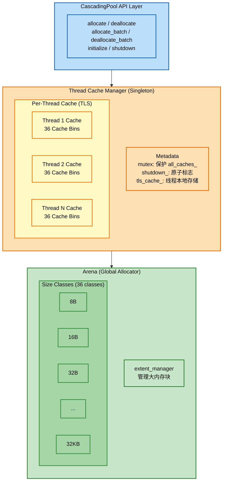
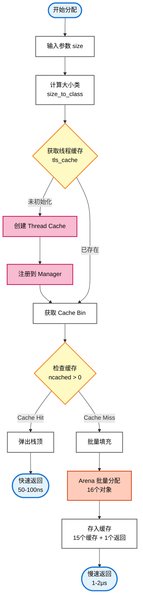
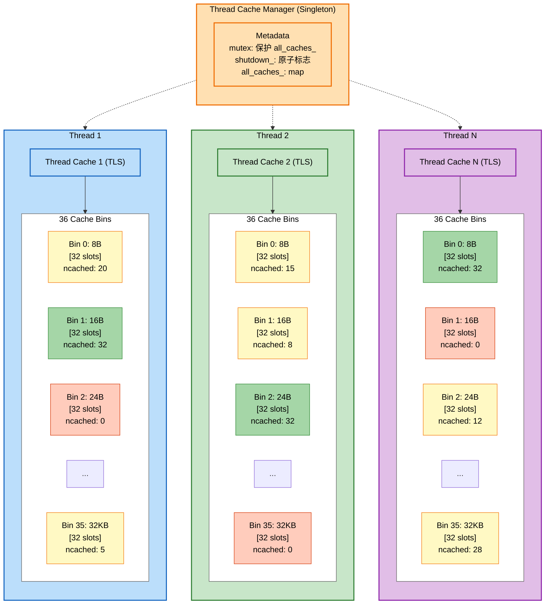

# CascadingPool

<p align="center">
  <strong>高性能分层内存分配器</strong><br>
  <em>High-Performance Hierarchical Memory Allocator</em>
</p>

<p align="center">
  
  
  
  
</p>

<p align="center">
  <a href="#特性">特性</a> •
  <a href="#架构">架构</a> •
  <a href="#快速开始">快速开始</a> •
  <a href="#性能">性能</a> •
  <a href="#模块详解">模块详解</a>
</p>

---

## 简介

CascadingPool 是一个为高性能应用设计的内存分配器，采用**分层架构**将线程本地缓存（Thread-Local Cache）与全局 arena 分配器相结合。通过无锁的线程缓存设计，实现了微秒级延迟和千万级每秒的吞吐量。

### 核心优势

- ⚡ **超低延迟**: P99.9 延迟仅 0.1 微秒
- 🚀 **高吞吐量**: 单线程 3200万+ ops/sec，16 线程 1.87亿+ ops/sec
- 🔒 **无锁设计**: 线程本地操作无需加锁
- 📊 **智能分片**: 36 个大小类自动匹配最优分配策略
- 🧵 **线程安全**: 原生支持高并发多线程环境

---

## 特性

| 特性           | 说明                                             |
| -------------- | ------------------------------------------------ |
| **分层架构**   | 线程本地缓存 + 全局 arena 分配器，减少全局竞争   |
| **无锁设计**   | 线程本地缓存操作完全无锁，仅全局状态使用轻量级锁 |
| **大小类优化** | 36 个大小类，根据对象大小自动选择最优分配策略    |
| **批量操作**   | 支持批量分配/释放，提高吞吐量和缓存命中率        |
| **内存对齐**   | 自动对齐到 8 字节边界，提升访问性能              |
| **线程安全**   | 多线程环境下安全使用，自动管理线程生命周期       |
| **可扩展性**   | 随着线程数增加，性能接近线性扩展                 |

---

## 架构

### 整体架构



**架构说明**：

- **API 层**：提供简洁的分配/释放接口
- **Thread Cache Manager**：单例管理器，维护所有线程的缓存映射
- **Thread Cache**：每个线程独立的 TLS 缓存，包含 36 个 Cache Bin
- **Arena**：全局分配器，管理实际内存，包含 36 个大小类

### 内存分配流程



**流程说明**：

1. **快速路径（Cache Hit）**：直接从线程缓存弹出指针，\~50-100ns
2. **慢速路径（Cache Miss）**：从 Arena 批量获取 16 个对象，15个缓存，1个返回，\~1-2μs

### 线程缓存结构



**结构说明**：

- **Thread Cache Manager**：单例模式，管理所有线程缓存的生命周期
- **Thread Cache**：每个线程通过 TLS 拥有独立实例，包含 36 个 Cache Bin
- **Cache Bin**：每个大小类对应一个 Bin，32 个槽位，使用 LIFO 栈结构
- **ncached**：当前缓存的对象数量，0 表示空，32 表示满
- **颜色说明**：绿色=满，红色=空，黄色=部分填充

---

## 快速开始

### 环境要求

- C++17 或更高版本
- CMake 3.10+
- 支持 C++17 的编译器（GCC 7+, Clang 5+, MSVC 2017+）

### 编译

```bash
# 克隆仓库
git clone https://github.com/YIice-cwj/CascadingPool.git
cd CascadingPool

# 创建构建目录
mkdir build && cd build

# 配置
cmake -DCMAKE_BUILD_TYPE=Release ..

# 编译
cmake --build . --config Release
```

#### 编译模式

支持四种编译模式，适用于不同场景：

| 模式               | 配置选项                            | 说明                       | 适用场景        |
| ------------------ | ----------------------------------- | -------------------------- | --------------- |
| **Debug**          | `-DCMAKE_BUILD_TYPE=Debug`          | 禁用优化，包含完整调试信息 | 开发调试        |
| **Release**        | `-DCMAKE_BUILD_TYPE=Release`        | 最大性能优化，无调试信息   | 生产环境        |
| **RelWithDebInfo** | `-DCMAKE_BUILD_TYPE=RelWithDebInfo` | 优化版本带调试信息         | 性能分析        |
| **MinSizeRel**     | `-DCMAKE_BUILD_TYPE=MinSizeRel`     | 最小体积优化               | 嵌入式/资源受限 |

**示例：**

```bash
# Debug 模式（开发调试）
cmake -DCMAKE_BUILD_TYPE=Debug ..
cmake --build . --config Debug

# Release 模式（正式发布）
cmake -DCMAKE_BUILD_TYPE=Release ..
cmake --build . --config Release

# 带调试信息的优化版本（性能分析）
cmake -DCMAKE_BUILD_TYPE=RelWithDebInfo ..
cmake --build . --config RelWithDebInfo

# 最小体积版本（嵌入式）
cmake -DCMAKE_BUILD_TYPE=MinSizeRel ..
cmake --build . --config MinSizeRel
```

**编译选项说明：**

- **MSVC**: `/O2` (最大速度), `/O1` (最小体积), `/Zi` (调试信息)
- **GCC/Clang**: `-O3` (最大优化), `-Os` (最小体积), `-g` (调试信息)

**推荐：**

- 开发阶段使用 `Debug` 模式，便于调试
- 发布时使用 `Release` 模式，获得最佳性能
- 性能分析时使用 `RelWithDebInfo`，兼顾优化和调试

### 使用示例

#### 基础用法

```cpp
#include "cascading/cascading_pool.h"
#include <iostream>

int main() {
    // 初始化内存池（必须在首次分配前调用）
    if (!cascading::initialize()) {
        std::cerr << "Failed to initialize memory pool!" << std::endl;
        return 1;
    }

    // 分配 64 字节内存
    void* ptr = cascading::allocate(64);
    if (ptr == nullptr) {
        std::cerr << "Allocation failed!" << std::endl;
        return 1;
    }

    // 使用内存...
    std::memset(ptr, 0, 64);
    int* data = static_cast<int*>(ptr);
    data[0] = 42;

    // 释放内存（size 必须与分配时一致）
    cascading::deallocate(ptr, 64);

    // 关闭内存池（释放所有资源）
    cascading::shutdown();
    return 0;
}
```

#### 批量操作

```cpp
#include "cascading/cascading_pool.h"

void batch_example() {
    cascading::initialize();

    const int batch_size = 100;
    void* ptrs[batch_size];

    // 批量分配（更高效）
    int allocated = cascading::allocate_batch(ptrs, batch_size, 64);
    std::cout << "Allocated " << allocated << " objects" << std::endl;

    // 使用内存...
    for (int i = 0; i < allocated; ++i) {
        // process ptrs[i]
    }

    // 批量释放
    cascading::deallocate_batch(ptrs, allocated, 64);

    cascading::shutdown();
}
```

#### 多线程使用

```cpp
#include "cascading/cascading_pool.h"
#include <thread>
#include <vector>

void worker_thread(int id) {
    for (int i = 0; i < 10000; ++i) {
        void* ptr = cascading::allocate(64);
        // 使用内存...
        cascading::deallocate(ptr, 64);
    }

    // 可选：清理当前线程的缓存（线程结束前调用）
    cascading::cleanup_current_thread();
}

void multi_thread_example() {
    cascading::initialize();

    std::vector<std::thread> threads;
    for (int i = 0; i < 8; ++i) {
        threads.emplace_back(worker_thread, i);
    }

    for (auto& t : threads) {
        t.join();
    }

    std::cout << "Active thread caches: "
              << cascading::get_thread_cache_count() << std::endl;

    cascading::shutdown();
}
```

---

## API 参考

### 核心函数

| 函数                              | 参数                                  | 返回值   | 描述                                                |
| --------------------------------- | ------------------------------------- | -------- | --------------------------------------------------- |
| `initialize()`                    | -                                     | `bool`   | 初始化内存池，首次调用返回 true，重复调用返回 false |
| `shutdown()`                      | -                                     | `void`   | 关闭内存池，清理所有线程缓存和 arena 资源           |
| `allocate(size)`                  | `size_t size`                         | `void*`  | 分配指定大小的内存，失败返回 nullptr                |
| `deallocate(ptr, size)`           | `void* ptr`, `size_t size`            | `void`   | 释放内存，ptr 可为 nullptr                          |
| `allocate_batch(ptrs, n, size)`   | `void** ptrs`, `int n`, `size_t size` | `int`    | 批量分配，返回实际分配数量                          |
| `deallocate_batch(ptrs, n, size)` | `void** ptrs`, `int n`, `size_t size` | `void`   | 批量释放内存                                        |
| `get_thread_cache_count()`        | -                                     | `size_t` | 获取当前活跃的线程缓存数量                          |
| `cleanup_current_thread()`        | -                                     | `void`   | 清理当前线程的缓存（线程退出前调用）                |

### 注意事项

1. **线程安全**: `initialize()` 和 `shutdown()` 不是线程安全的，应在主线程中调用
2. **size 参数**: `deallocate` 的 size 必须与 `allocate` 时一致，用于确定大小类
3. **nullptr 处理**: `deallocate(nullptr, size)` 是安全的，不会崩溃
4. **批量操作**: 批量操作比单对象操作更高效，建议批量场景使用

---

## 性能

### 测试环境

| 项目       | 配置                                          |
| ---------- | --------------------------------------------- |
| **OS**     | Windows 11 专业工作站版 25H2 (26200.8037)     |
| **CPU**    | AMD Ryzen 7 5800X 8-Core Processor (3.80 GHz) |
| **内存**   | 32 GB                                         |
| **编译器** | MinGW-w64 GCC 15.2.0                          |
| **构建**   | Release (-O3)                                 |

### 单线程性能

| 指标                 | 数值               |
| -------------------- | ------------------ |
| 分配/释放吞吐量      | **3280万 ops/sec** |
| 平均延迟             | **\~30 纳秒**      |
| 批量吞吐量 (32个/批) | **5267万 ops/sec** |

### 多线程扩展性

| 线程数 | 吞吐量         | 扩展效率 | 总操作数 |
| ------ | -------------- | -------- | -------- |
| 1      | 3127万 ops/sec | 1.0x     | 100万    |
| 2      | 5971万 ops/sec | 1.9x     | 200万    |
| 4      | 1.22亿 ops/sec | 3.9x     | 400万    |
| 8      | 1.53亿 ops/sec | 4.9x     | 800万    |
| 16     | 1.87亿 ops/sec | 6.0x     | 1600万   |

### 延迟分布

| 百分位 | 延迟       | 说明                         |
| ------ | ---------- | ---------------------------- |
| P50    | **0.1 μs** | 缓存命中，直接从线程缓存分配 |
| P90    | **0.1 μs** | 绝大多数操作在 0.1μs 内完成  |
| P99    | **0.1 μs** | 极端情况下仍保持低延迟       |
| P99.9  | **0.1 μs** | 稳定的亚微秒级延迟           |

### 不同大小类性能

| 对象大小   | 吞吐量             | 说明                   |
| ---------- | ------------------ | ---------------------- |
| 8 bytes    | **4103万 ops/sec** | 最小对象，缓存效率最高 |
| 16 bytes   | **3409万 ops/sec** | 小对象，性能优秀       |
| 32 bytes   | **3263万 ops/sec** | 常见大小，性能稳定     |
| 64 bytes   | **3163万 ops/sec** | 常用对象大小           |
| 128 bytes  | **3276万 ops/sec** | 中等对象，性能良好     |
| 256 bytes  | **3089万 ops/sec** | 较大对象，略有下降     |
| 512 bytes  | **3244万 ops/sec** | 大对象，性能稳定       |
| 1024 bytes | **3294万 ops/sec** | 大对象，性能稳定       |
| 2048 bytes | **3221万 ops/sec** | 大对象，性能回升       |
| 4096 bytes | **3274万 ops/sec** | 大对象，性能优秀       |

### 并发性能

| 测试项               | 性能指标           |
| -------------------- | ------------------ |
| 并发热点测试 (8线程) | **2.29亿 ops/sec** |

---

## 模块详解

### 1. Thread Cache Manager（线程缓存管理器）

**文件**: `include/cascading/thread_cache/thread_cache_manager.h`

线程缓存管理器是整个系统的核心协调者，采用单例模式设计：

#### 职责

- 管理所有线程的 `thread_cache` 实例
- 提供线程本地存储（TLS）机制
- 协调线程缓存与 arena 之间的交互
- 处理线程生命周期（创建/销毁）

#### 关键设计

```cpp
class thread_cache_manager {
    // 线程本地存储
    static thread_local thread_cache* tls_cache_;
    static thread_local bool tls_initialized_;

    // 全局状态（受 mutex 保护）
    mutable std::mutex mutex_;
    std::unordered_map<std::thread::id, thread_cache*> all_caches_;
    std::atomic<bool> shutdown_{false};
};
```

#### 工作流程

1. **首次分配**: 线程首次调用 `allocate()` 时，自动创建 `thread_cache`
2. **缓存复用**: 后续分配直接使用线程本地缓存，无需加锁
3. **线程退出**: 可调用 `cleanup_current_thread()` 主动清理，或依赖进程退出时的自动清理

---

### 2. Thread Cache（线程本地缓存）

**文件**: `include/cascading/thread_cache/thread_cache.h`

每个线程拥有独立的缓存，是性能的关键：

#### 结构

- **36 个 Cache Bin**: 每个大小类对应一个 Bin
- **每个 Bin 32 槽位**: 使用 LIFO 栈结构，提高缓存命中率
- **批量填充**: 缓存空时从 arena 批量获取 16 个对象

#### 配置常量

```cpp
constexpr std::size_t TCACHE_SIZE = 32;        // 每 Bin 槽位数
constexpr std::size_t TCACHE_FILL_BATCH = 16;  // 批量填充数量
constexpr std::size_t TCACHE_FLUSH_BATCH = 16; // 刷新阈值
```

#### 分配流程

```
allocate(size)
    ↓
size_to_class(size) → class_index
    ↓
bins_[class_index].allocate()
    ↓
[有缓存] 直接返回 (O(1))
[无缓存] fill_cache() → 从 arena 批量获取
```

---

### 3. Cache Bin（缓存槽）

**文件**: `include/cascading/thread_cache/cache_bin.h`

Cache Bin 是线程缓存的基本单元：

#### 数据结构

```cpp
struct cache_bin {
    void* ptrs[TCACHE_SIZE] = {};  // 固定大小数组
    uint16_t ncached = 0;          // 当前缓存数量
};
```

#### 操作

- **allocate()**: 从栈顶弹出指针，O(1)
- **deallocate()**: 压入栈顶，O(1)
- **LIFO 策略**: 最近释放的内存最可能被再次使用，提高 CPU 缓存命中率

---

### 4. Arena（全局分配器）

**文件**: `include/cascading/arena/arena.h`

Arena 是实际管理内存的组件：

#### 内存组织

```
Arena
├── extent_manager (管理大内存块)
└── size_classes[36] (36 个大小类)
    ├── size_class<8>
    ├── size_class<16>
    ├── ...
    └── size_class<3456>
```

#### 大小类设计

| 范围      | 间隔     | 大小类数量 |
| --------- | -------- | ---------- |
| 8-128B    | 8B       | 16         |
| 160-3456B | ~25%增长 | 20         |

**说明**：

- 前16个大小类：从8字节开始，每次增加8字节（8, 16, 24, ..., 128）
- 后20个大小类：按约25%增长（160, 200, 248, 312, ..., 3456）
- 总共36个大小类，最大支持3456字节

#### 内存分配策略

- **小对象 (≤ 3456B)**: 通过 size_class 分配，使用 slab 分配器
- **中等对象 (3456B - 32KB)**: 通过 extent_manager 分配
- **大对象 (≥ 32KB)**: 直接系统分配

---

### 5. Size Class（大小类）

**文件**: `include/cascading/arena/size_class.h`

大小类管理特定大小的对象分配：

#### 内存层级

```
Size Class
├── chunk_list (无锁链表)
│   ├── chunk[0] (4MB)
│   ├── chunk[1] (4MB)
│   └── ...
├── active_chunk (当前活跃 chunk)
└── chunk_count (chunk 数量)
```

**设计特点**：

- **无锁链表**: 使用 `lock_free_list` 管理 chunk，支持高并发
- **活跃 chunk**: 当前用于分配的 chunk，减少链表遍历
- **Chunk 最大数量**: 128 个，总计 512MB 内存空间

#### Chunk 结构

每个 Chunk 是一个 4MB 的内存块，包含多个 Slab：

```
Chunk (4MB)
├── slab_groups[16] (Slab 组)
│   ├── slab_group[0] (16 个 slab, 每个 256KB)
│   ├── slab_group[1]
│   └── ...
└── data_region (数据区域)
```

#### Slab 结构

每个 Slab 是一个 256KB 的内存块，被划分为固定大小的对象槽位：

```
Slab Metadata (元数据)
├── bitmap (位图)
│   └── 每个 bit 表示一个槽位状态: 0=空闲, 1=已分配
├── next_search_start (下一个搜索起始位置)
├── allocated_count (已分配计数)
└── data_region (指向数据区域的指针)

Data Region (数据区域)
├── slot[0]
├── slot[1]
├── ...
└── slot[N]
```

**设计特点**：

- **位图管理**: 使用 64 位原子操作管理分配状态，无锁并发安全
- **分离存储**: 元数据与数据区域分离，提高缓存命中率
- **快速搜索**: 记录搜索起始位置，优化分配速度

---

### 6. Extent Manager（内存块管理器）

**文件**: `include/cascading/extent_tree/extent_manager.h`

Extent Manager 管理大块内存的分配和回收：

#### 职责

- 从操作系统申请大块内存
- 管理内存块的生命周期
- 支持内存块的合并和分裂

#### 内存状态

```
Extent States
├── in_use (正在使用)
├── dirty (已释放，未清理)
├── muzzy (已清理，未归还)
└── retained (已归还给操作系统)
```

---

## 项目结构

```
CascadingPool/
├── include/cascading/           # 头文件
│   ├── arena/                   # Arena 分配器
│   │   ├── arena.h
│   │   ├── chunk.h
│   │   ├── size_class.h
│   │   ├── size_class_table.h
│   │   ├── slab.h
│   │   └── slab_group.h
│   ├── extent_tree/             # 内存块管理
│   │   ├── extent.h
│   │   ├── extent_manager.h
│   │   └── *_tree.h
│   ├── thread_cache/            # 线程缓存
│   │   ├── cache_bin.h
│   │   ├── thread_cache.h
│   │   └── thread_cache_manager.h
│   ├── utils/                   # 工具类
│   │   ├── lock_free_*.h
│   │   └── tagged_*.h
│   ├── cascading_pool.h         # 主接口
│   └── cpu_affinity.h
├── src/                         # 源文件
├── tests/                       # 测试文件
├── CMakeLists.txt
└── README.md
```

---

## 测试

项目包含完整的单元测试和性能测试：

```bash
# 运行测试
./bin/cascading_pool_test.exe
```

### 测试覆盖

- ✅ 基础分配/释放
- ✅ 批量操作
- ✅ 多线程并发
- ✅ 内存完整性
- ✅ 压力测试
- ✅ 性能基准

---

## 许可证

本项目采用 MIT 许可证。详见 [LICENSE](LICENSE) 文件。

---

<p align="center">
  <strong>Made with ❤️ by YIice</strong>
</p>
